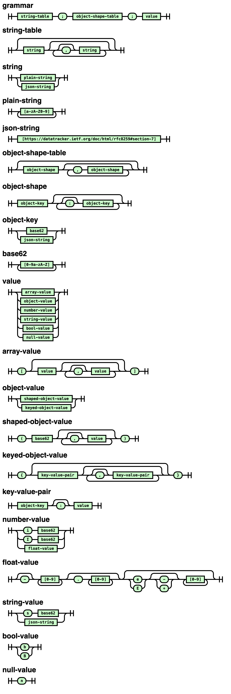

# JCOF: JSON-like Compact Object Format

A more efficient way to represent JSON-style objects.

## About

JCOF tries to be a drop-in replacement for JSON, with most of the same semantics, but with a much
more compact representation of objects. The main way it does this is to introduce a string table
at the beginning of the object, and then replace all strings with indexes into that string table.
It also employs a few extra tricks to make objects as small as possible, without losing the most
important benefits of JSON. Most importantly, it remains a text-based, schemaless format.

The following JSON object:

```json
{
	"people": [
		{"first-name": "Bob", "age": 32, "occupation": "Plumber", "full-time": true},
		{"first-name": "Alice", "age": 28, "occupation": "Programmer", "full-time": true},
		{"first-name": "Bernard", "age": 36, "occupation": null, "full-time": null},
		{"first-name": "El", "age": 57, "occupation": "Programmer", "full-time": false}
	]
}
```

could be represented as the following JCOF object:

```
Programmer;"age""first-name""full-time""occupation";
{"people"[(0,iw"Bob"b"Plumber")(0,is"Alice"b,s0)(0,iA"Bernard"n,n)(0,iV"El"B,s0)]}
```

Minimized, the JSON is 299 bytes, with 71.5 bytes on average per person object.
The JCOF is 134 bytes, with only 17.5 bytes per person object; that's 0.45x the size in total,
and 0.23x the size per person object.
The reason the JCOF is so much smaller is threefold:

1. It has a string table, so that strings which occur multiple times only have to be
   included in the JCOF document once. In this example object, the only duplicated string
   is "Programmer".
2. It has an object shapes table, so that object shapes which occur multiple times only have to
   have their keys encoded once. In this example object, the only duplicated object shape
   is `{"age", "first-name", "full-time", "occupation"}`.
3. It has more compact encodings for various values and syntax.
   Large integers can be encoded as base 62 rather than base 10,
   booleans and null are encoded using single characters,
   and separator characters can be skipped where that results in an unambiguous document.

## Rationale

I was making a JSON-based serialization format for a game I was working on, but found myself
making trade-offs between space efficiency and descriptive key names, so decided to make
a format which makes that a non-issue. I then kept iterating on it until I had
what I call JCOF today.

In most cases, you would use plain JSON, or if size is a concern, you would use gzipped JSON.
But there are times when size is a concern and you can't reasonably use gzip; for example,
gzipping stuff from JavaScript in the browser is inconvenient until
[TextEncoderStream](https://developer.mozilla.org/en-US/docs/Web/API/TextEncoderStream)
is supported in Firefox, and having a smaller uncompressed encoding can be an advantage
some cases even where gzip is used.
I've also observed significant reductions in size between compressed JSON and compressed JCOF
in certain cases.

I'm publishing it because other people may find it useful too.
If you don't find it useful, feel free to disregard it.

## Reference implementations

The only reference implementation currently is the javascript one, in
[implementations/javascript/jcof.js](implementations/javascript/jcof.js).
It's published on NPM here: https://www.npmjs.com/package/jcof

## Benchmarks

This is the sizes of various documents in JSON compared to JCOF (from the test suite):

```
tiny.json:
  JSON: 299 bytes
  JCOF: 134 bytes (0.448x)
circuitsim.json:
  JSON: 8315 bytes
  JCOF: 2093 bytes (0.252x)
pokemon.json:
  JSON: 219635 bytes
  JCOF: 39650 bytes (0.181x)
pokedex.json:
  JSON: 56812 bytes
  JCOF: 23132 bytes (0.407x)
madrid.json:
  JSON: 37960 bytes
  JCOF: 11923 bytes (0.314x)
meteorites.json:
  JSON: 244920 bytes
  JCOF: 87028 bytes (0.355x)
comets.json:
  JSON: 51949 bytes
  JCOF: 37480 bytes (0.721x)
````

## The format

Here's the grammar which describes JCOF:

```ebnf
grammar ::= string-table ';' object-shape-table ';' value

string-table ::= (string (','? string)*)?
string ::= plain-string | json-string
plain-string ::= [a-zA-Z0-9]+
json-string ::= [https://datatracker.ietf.org/doc/html/rfc8259#section-7]

object-shape-table ::= (object-shape (',' object-shape)*)?
object-shape ::= object-key (':'? object-key)*
object-key ::= base62 | json-string
base62 ::= [0-9a-zA-Z]+

value ::=
  array-value |
  object-value |
  number-value |
  string-value |
  bool-value |
  null-value

array-value ::= '[' (value (','? value)*)? ']'
object-value ::= shaped-object-value | keyed-object-value
shaped-object-value ::= '(' base62 (','? value)* ')'
keyed-object-value ::= '{' (key-value-pair (','? key-value-pair)*)? '}'
key-value-pair ::= object-key ':'? value
number-value ::= 'i' base62 | 'I' base62 | 'finf' | 'fInf' | 'fnan' | float-value
float-value ::= '-'? [0-9]+ ('.' [0-9]+)? (('e' | 'E') ('-' | '+')? [0-9]+)?
string-value ::= 's' base62 | json-string
bool-value ::= 'b' | 'B'
null-value ::= 'n'
```

See the bottom of the readme for a [railroad diagram](#railroad-diagram).

In addition to the grammar, you should know the following:

### Many separators are optional

The grammar contains optional separators (`','?`, `':'?`). These separators can be skipped
if either the character before or the character after is any of the following:
`[`, `]`, `{`, `}`, `(`, `)`, `,`, `:` or `"`. This saves a bunch of bytes.
JCOF generators can choose to always emit separators, but parsers must accept
JCOF documents with missing separators.

### The string table

All JCOF objects start with a string table, which is a list of strings separated by
an optional `,`.

### The object shapes table

An "object shape" is defined as a list of keys. If you have a bunch of objects with
the same keys, it's usually advantageous to define that set of keys once in the
object shapes table and encode the objects with the shaped objects syntax.
An object shape is a list of object keys optionally separated by `:`,
and the object shape table is a list of object shapes (non-optionally) separated by `,`

### Base62

Base62 encoding just refers to writing integer numbers in base 62 rather than base 10.
This lets us use 0-9, a-z and A-Z as digits. The characters from `0` to `9` represent
0-9, the characters `a` to `f` represent 10-26, and the characters `A` to `F` represent
27-62.

### Values

A value can be:

* An array literal: `[`, followed by 0 or more values, followed by `]`
* A shaped object literal: `(`, followed by an object shape index, followed by values, followed by `)`
	* The object shape index is a base62-encoded index into the object shapes table
* An object literal: `{`, followed by 0 or more key-value pairs, followed by `}`
	* A key-value pair is a base62 index into the header, followed by a `:`, followed by a value
* A string reference: `s` followed by a base62 index into the header
* A JSON string literal
* A number literal:
	* `i` followed by a base62 number: A positive integer
	* `I` followed by a base62 number: A negative integer
	* A floating point number written in decimal, with an optional fractional part and
	  an optional exponent part
* A bool literal:
	`b`: true
	`B`: false
* A null literal: `n`

### Semantics

JSON has been criticized for leaving a lot of stuff up to the implementation.
JCOF has a stricter semantics for what a JCOF document means. Incidentally, these semantics can
be applied to JSON as well, so "JSON with JCOF-style semantics" would be a useful subset of JSON
with more well-defined semantics.

Values can be any of the following types:

* Null.
* Boolean: true or false.
* String: A UTF-8 encoded list of Unicode code points.
* Number: A double precision IEEE 754 floating point value.
	* The values Infinity, -Infinity and NaN are not representable. A serializer should either
	  produce a null or signal an error if asked to serialize an unrepresentable number value.
* Array: An ordered collection of 0 or more values.
* Object: An unordered collection of 0 or more key-value pairs with strings as keys.
  An object cannot have two or more key-value pairs with _the same_ key.

Two values are considered _the same_ only if they are of the same type and comply with
the following equality rules for their type:

* Null: Two null values always considered _the same_.
* Boolean: Two boolean values are considered _the same_ if both are true or both are false.
* String: Two string values are considered _the same_ if they have the same UTF-8 code units
  in the same order.
* Number: Two numbers are considered _the same_ only if they represent the same IEEE 754
  double precision floating point value. Two IEEE 754 double precision floating point values are
  considered _the same_ if they have the same bits, or if both numbers represent 0, or if both
  numbers represent -0.
* Array: Two arrays A and B are considered _the same_ if they have the same number of values, and if
  the value at index i of A is _the same_ as the value at index i of B for every index i in the arrays.
* Object: Two objects A and B are considered _the same_ if every key in A is _the same_ as a key
  in B and vice versa, and the value at key k of A is _the same_ as the value at key k of B for every
  key k in the objects. The ordering of the keys is irrelevant.

An encoder can use these rules to pick optimal ways to represent values. If two representations are
_the same_ according to these rules, the encoder can freely pick between them.
Notably, it is often useful to sort the keys in objects, so that multiple objects with the same keys
in different order can use the same object shape.

### Railroad diagram

generated with
[bnf-railroad-generator](https://github.com/mortie/bnf-railroad-generator)


